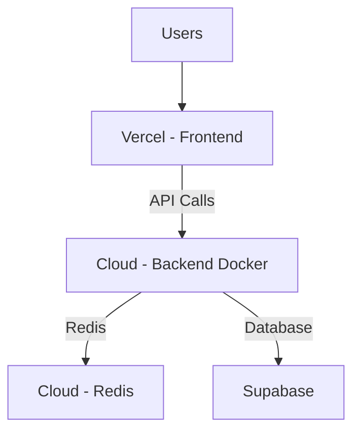

# Docker Deployment Guide for Helium AI
**Deploying Backend on GCP/AWS with Docker While Keeping Frontend on Vercel**

## 🎯 Overview

This guide shows how to:
1. Deploy your **Frontend** on **Vercel** (no changes needed)
2. Deploy your **Backend** on **GCP or AWS** using **Docker**
3. Connect them properly so they can communicate

## 🔄 How Components Connect



The frontend makes API calls to your backend URL, which processes requests and communicates with Redis and Supabase.

## 🚀 Option 1: Deploy Backend to GCP Cloud Run

### **Step 1: Prepare Your Backend for Docker**

Your backend already has a Dockerfile, but let's optimize it:

File: `backend/Dockerfile`
```dockerfile
FROM python:3.11-slim

# Install system dependencies
RUN apt-get update && apt-get install -y \
    curl \
    && rm -rf /var/lib/apt/lists/*

# Set working directory
WORKDIR /app

# Install UV package manager
COPY --from=ghcr.io/astral-sh/uv:latest /uv /usr/local/bin/uv

# Copy dependency files
COPY pyproject.toml uv.lock ./

# Install dependencies
RUN uv sync --frozen --no-dev

# Copy source code
COPY . .

# Health check
HEALTHCHECK --interval=30s --timeout=10s --start-period=5s --retries=3 \
    CMD curl -f http://localhost:8000/api/health || exit 1

# Expose port
EXPOSE 8000

# Run application
CMD ["uv", "run", "api.py"]
```

### **Step 2: Deploy to GCP Cloud Run**

1. **Install Google Cloud CLI**:
   ```bash
   # On Mac
   brew install google-cloud-cli
   ```

2. **Authenticate and set project**:
   ```bash
   gcloud auth login
   gcloud config set project YOUR_PROJECT_ID
   ```

3. **Build and deploy**:
   ```bash
   # Build Docker image
   cd backend
   gcloud builds submit --tag gcr.io/YOUR_PROJECT_ID/helium-backend
   
   # Deploy to Cloud Run
   gcloud run deploy helium-backend \
     --image gcr.io/YOUR_PROJECT_ID/helium-backend \
     --platform managed \
     --region us-central1 \
     --allow-unauthenticated \
     --set-env-vars REDIS_HOST=YOUR_REDIS_HOST,SUPABASE_URL=YOUR_SUPABASE_URL \
     --memory 2Gi \
     --cpu 1
   ```

### **Step 3: Set Up Redis on GCP**

1. **Create Redis instance**:
   ```bash
   gcloud redis instances create helium-redis \
     --size=1 \
     --region=us-central1 \
     --tier=standard \
     --redis-version=redis_7_0
   ```

2. **Get Redis connection details**:
   ```bash
   gcloud redis instances describe helium-redis --region=us-central1
   ```

## 🚀 Option 2: Deploy Backend to AWS ECS

### **Step 1: Prepare ECS Task Definition**

File: `backend/ecs-task-definition.json`
```json
{
  "family": "helium-backend",
  "networkMode": "awsvpc",
  "requiresCompatibilities": ["FARGATE"],
  "cpu": "1024",
  "memory": "2048",
  "executionRoleArn": "arn:aws:iam::ACCOUNT:role/ecsTaskExecutionRole",
  "containerDefinitions": [
    {
      "name": "helium-backend",
      "image": "ACCOUNT.dkr.ecr.REGION.amazonaws.com/helium-backend:latest",
      "portMappings": [
        {
          "containerPort": 8000,
          "protocol": "tcp"
        }
      ],
      "environment": [
        {
          "name": "REDIS_HOST",
          "value": "YOUR_ELASTICACHE_ENDPOINT"
        },
        {
          "name": "SUPABASE_URL",
          "value": "YOUR_SUPABASE_URL"
        }
      ],
      "logConfiguration": {
        "logDriver": "awslogs",
        "options": {
          "awslogs-group": "/ecs/helium-backend",
          "awslogs-region": "us-east-1",
          "awslogs-stream-prefix": "ecs"
        }
      }
    }
  ]
}
```

### **Step 2: Deploy to AWS ECS**

1. **Create ECR repository**:
   ```bash
   aws ecr create-repository --repository-name helium-backend
   ```

2. **Build and push Docker image**:
   ```bash
   cd backend
   aws ecr get-login-password --region us-east-1 | docker login --username AWS --password-stdin ACCOUNT.dkr.ecr.us-east-1.amazonaws.com
   
   docker build -t helium-backend .
   docker tag helium-backend:latest ACCOUNT.dkr.ecr.us-east-1.amazonaws.com/helium-backend:latest
   docker push ACCOUNT.dkr.ecr.us-east-1.amazonaws.com/helium-backend:latest
   ```

3. **Register task definition**:
   ```bash
   aws ecs register-task-definition --cli-input-json file://ecs-task-definition.json
   ```

4. **Create ECS service**:
   ```bash
   aws ecs create-service \
     --cluster your-cluster \
     --service-name helium-backend \
     --task-definition helium-backend \
     --desired-count 1 \
     --launch-type FARGATE
   ```

### **Step 3: Set Up Redis on AWS ElastiCache**

1. **Create Redis cluster via AWS Console** or CLI:
   ```bash
   aws elasticache create-replication-group \
     --replication-group-id helium-redis \
     --replication-group-description "Helium Redis" \
     --engine redis \
     --cache-node-type cache.t3.micro \
     --num-cache-clusters 1
   ```

## 🔌 Connecting Frontend and Backend

### **How They Communicate**

1. **Frontend makes API calls** to your backend URL
2. **Backend processes requests** and communicates with Redis/Supabase
3. **Responses flow back** to the frontend

### **Environment Variables Setup**

#### **Frontend (.env.production in Vercel)**
```env
NEXT_PUBLIC_BACKEND_URL=https://your-backend-url.run.app  # GCP Cloud Run URL or AWS ECS URL
NEXT_PUBLIC_SUPABASE_URL=your-supabase-url
NEXT_PUBLIC_SUPABASE_ANON_KEY=your-supabase-anon-key
```

#### **Backend (Environment Variables in Cloud)**
```env
# Redis Configuration
REDIS_HOST=your-redis-host-from-cloud
REDIS_PORT=6379
REDIS_PASSWORD=

# Supabase Configuration
SUPABASE_URL=your-supabase-url
SUPABASE_SERVICE_ROLE_KEY=your-service-role-key

# Other configurations
ENV_MODE=production
LOG_LEVEL=INFO
```

## 🐳 Running Background Worker

You need to run the background worker alongside your main backend:

### **Option 1: Separate Service (Recommended)**

Create a separate service for the worker:

**GCP Cloud Run Worker**:
```bash
# Build worker image (same as backend but different CMD)
gcloud builds submit --tag gcr.io/YOUR_PROJECT_ID/helium-worker

# Deploy worker
gcloud run deploy helium-worker \
  --image gcr.io/YOUR_PROJECT_ID/helium-worker \
  --platform managed \
  --region us-central1 \
  --allow-unauthenticated \
  --set-env-vars REDIS_HOST=YOUR_REDIS_HOST,SUPABASE_URL=YOUR_SUPABASE_URL \
  --memory 1Gi \
  --cpu 1 \
  --command "uv" \
  --args "run,dramatiq,run_agent_background"
```

### **Option 2: Same Container with Process Manager**

Update your Dockerfile to run both processes:

File: `backend/Dockerfile.worker`
```dockerfile
FROM python:3.11-slim

# Install system dependencies
RUN apt-get update && apt-get install -y \
    curl supervisor \
    && rm -rf /var/lib/apt/lists/*

# Set working directory
WORKDIR /app

# Install UV package manager
COPY --from=ghcr.io/astral-sh/uv:latest /uv /usr/local/bin/uv

# Copy dependency files
COPY pyproject.toml uv.lock ./

# Install dependencies
RUN uv sync --frozen --no-dev

# Copy source code
COPY . .

# Copy supervisor config
COPY supervisord.conf /etc/supervisor/conf.d/supervisord.conf

# Expose port
EXPOSE 8000

# Run supervisor
CMD ["/usr/bin/supervisord", "-c", "/etc/supervisor/conf.d/supervisord.conf"]
```

File: `backend/supervisord.conf`
```ini
[supervisord]
nodaemon=true

[program:api]
command=uv run api.py
directory=/app
autostart=true
autorestart=true
stdout_logfile=/dev/stdout
stdout_logfile_maxbytes=0
stderr_logfile=/dev/stderr
stderr_logfile_maxbytes=0

[program:worker]
command=uv run dramatiq run_agent_background
directory=/app
autostart=true
autorestart=true
stdout_logfile=/dev/stdout
stdout_logfile_maxbytes=0
stderr_logfile=/dev/stderr
stderr_logfile_maxbytes=0
```

## 🔧 Configuration Updates Needed

### **Update Redis Configuration**

File: `backend/services/redis.py`
```python
# Already updated in previous step - no further changes needed
```

### **Update Supabase Configuration**

File: `backend/services/supabase.py`
```python
# No changes needed - it already reads from environment variables
```

### **Update API Health Check**

File: `backend/api.py`
```python
# Add this if not already present
@app.get("/health")
async def health_check():
    return {
        "status": "ok", 
        "timestamp": datetime.now(timezone.utc).isoformat()
    }
```

## 🌐 Network Configuration

### **GCP Network Setup**
1. Ensure Cloud Run services are publicly accessible
2. Configure VPC if using private Redis
3. Set up proper IAM permissions

### **AWS Network Setup**
1. Configure security groups to allow traffic
2. Set up VPC if using private ElastiCache
3. Configure IAM roles for ECS

## 🧪 Testing the Connection

### **1. Test Backend Health**
```bash
curl https://your-backend-url.run.app/api/health
```

### **2. Test Frontend Environment Variables**
Check that your frontend is configured to point to the correct backend URL.

### **3. Test API Endpoints**
Try calling a simple API endpoint from your frontend to ensure connectivity.

## 💰 Cost Estimation (Monthly)

### **GCP Pricing**
- **Cloud Run**: $10-50 (based on usage)
- **Memorystore**: $30-150 (based on Redis size)
- **Total**: ~$40-200/month

### **AWS Pricing**
- **ECS Fargate**: $30-100 (based on usage)
- **ElastiCache**: $15-100 (based on Redis size)
- **Total**: ~$45-200/month

## 🚦 Deployment Checklist

### **Pre-deployment**
- [ ] Set up cloud account (GCP or AWS)
- [ ] Install required CLI tools
- [ ] Configure authentication
- [ ] Prepare environment variables

### **Deployment**
- [ ] Deploy Redis (Memorystore/ElastiCache)
- [ ] Deploy Backend (Cloud Run/ECS)
- [ ] Configure environment variables in cloud
- [ ] Deploy Frontend to Vercel
- [ ] Configure frontend environment variables

### **Post-deployment**
- [ ] Test all endpoints
- [ ] Verify component connections
- [ ] Set up monitoring
- [ ] Configure auto-scaling

## 🆘 Troubleshooting Common Issues

### **Connection Issues**
1. **Frontend can't reach backend**
   - Check backend URL in frontend env vars
   - Verify backend is publicly accessible
   - Check CORS configuration

2. **Backend can't reach Redis**
   - Verify Redis connection details
   - Check network/firewall rules
   - Ensure Redis is running

3. **Backend can't reach Supabase**
   - Verify Supabase URL and keys
   - Check network connectivity
   - Confirm Supabase project settings

### **Deployment Issues**
1. **Docker build fails**
   - Check dependencies in pyproject.toml
   - Ensure all files are properly copied
   - Verify Python version compatibility

2. **Cloud deployment fails**
   - Check IAM permissions
   - Verify resource quotas
   - Confirm region availability

This guide provides a complete approach to deploying your Helium AI application with the frontend on Vercel and backend on GCP/AWS using Docker, maintaining proper connectivity between all components.