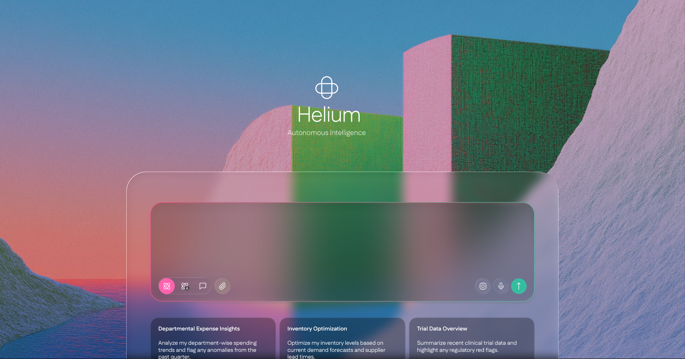

<div align="center">

# Helium AI - The God Mode Agent for Enterprises

(that acts on your behalf)



Helium AI is an God Mode Agent that helps you accomplish real-world tasks with ease. Through natural conversation, Helium becomes your digital companion for research, data analysis, and everyday challenges—combining powerful capabilities with an intuitive interface that understands what you need and delivers results.

Helium's powerful toolkit includes seamless browser automation to navigate the web and extract data, file management for document creation and editing, web crawling and extended search capabilities, command-line execution for system tasks, website deployment, and integration with various APIs and services. These capabilities work together harmoniously, allowing Helium to solve your complex problems and automate workflows through simple conversations!


</div>

## Table of Contents

- [Backend API](#backend-api)
- [Frontend](#frontend)
- [Agent Docker](#agent-docker)
- [Supabase Database](#supabase-database)
- [Use Cases](#use-cases)
- [Self-Hosting](#self-hosting)
- [Acknowledgements](#acknowledgements)
- [License](#license)

### Backend API

Python/FastAPI service that handles REST endpoints, thread management, and LLM integration with Anthropic, and others via LiteLLM.

### Frontend

Next.js/React application providing a responsive UI with chat interface, dashboard, etc.

### Agent Docker

Isolated execution environment for every agent - with browser automation, code interpreter, file system access, tool integration, and security features.

### Supabase Database

Handles data persistence with authentication, user management, conversation history, file storage, agent state, analytics, and real-time subscriptions.

## Self-Hosting

Helium AI can be self-hosted on your own infrastructure using our comprehensive setup wizard. For a complete guide to self-hosting Helium AI, please refer to our [Self-Hosting Guide](./docs/SELF-HOSTING.md).

The setup process includes:

- Setting up a Supabase project for database and authentication
- Configuring Redis for caching and session management
- Setting up Daytona for secure agent execution
- Integrating with LLM providers (Anthropic, OpenAI etc.)
- Configuring web search and scraping capabilities (Tavily, Firecrawl)
- Setting up QStash for background job processing and workflows
- Configuring webhook handling for automated tasks
- Optional integrations (RapidAPI for data providers)

### Quick Start

1. **Clone the repository**:

```bash
git clone https://github.com/neuralarc-ai/he2.git
cd he2
```

2. **Run the setup wizard**:

```bash
python setup.py
```

The wizard will guide you through 14 steps with progress saving, so you can resume if interrupted.

3. **Start or stop the containers**:

```bash
python start.py
```

### Manual Setup

See the [Self-Hosting Guide](./docs/SELF-HOSTING.md) for detailed manual setup instructions.

The wizard will guide you through all necessary steps to get your Helium AI instance up and running. For detailed instructions, troubleshooting tips, and advanced configuration options, see the [Self-Hosting Guide](./docs/SELF-HOSTING.md).

## Contributing

We welcome contributions from the community! Please see our [Contributing Guide](./CONTRIBUTING.md) for more details.

## Acknowledgements

### Technologies

- [Daytona](https://daytona.io/) - Secure agent execution environment
- [Supabase](https://supabase.com/) - Database and authentication
- [Playwright](https://playwright.dev/) - Browser automation
- [OpenAI](https://openai.com/) - LLM provider
- [Anthropic](https://www.anthropic.com/) - LLM provider
- [Morph](https://morphllm.com/) - For AI-powered code editing
- [Tavily](https://tavily.com/) - Search capabilities
- [Firecrawl](https://firecrawl.dev/) - Web scraping capabilities
- [QStash](https://upstash.com/qstash) - Background job processing and workflows
- [RapidAPI](https://rapidapi.com/) - API services
- Custom MCP servers - Extend functionality with custom tools

## License

NeuralArc Helium AI is licensed under the Apache License, Version 2.0. See [LICENSE](./LICENSE) for the full license text.
