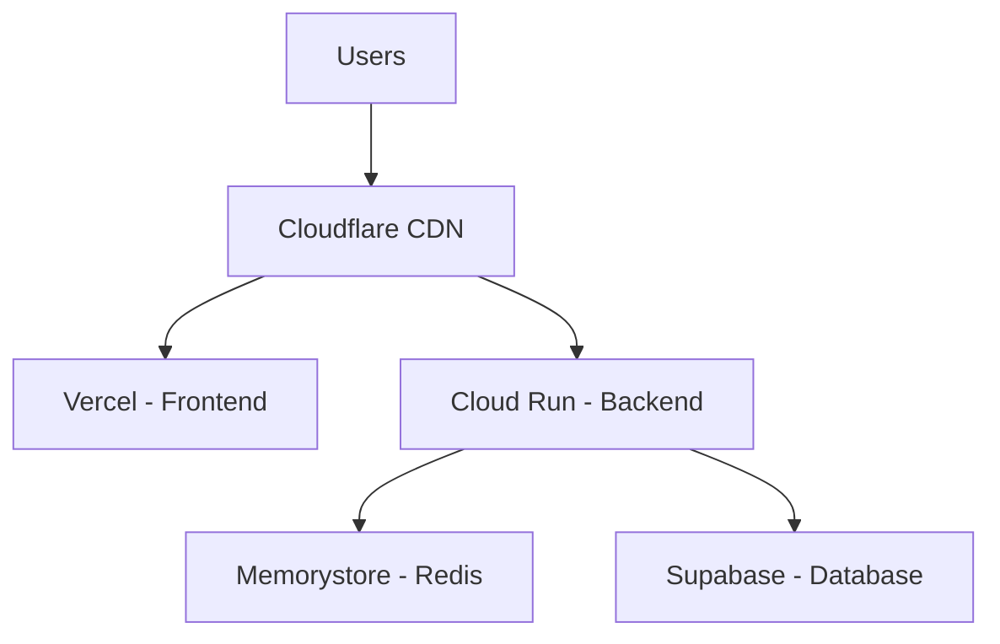
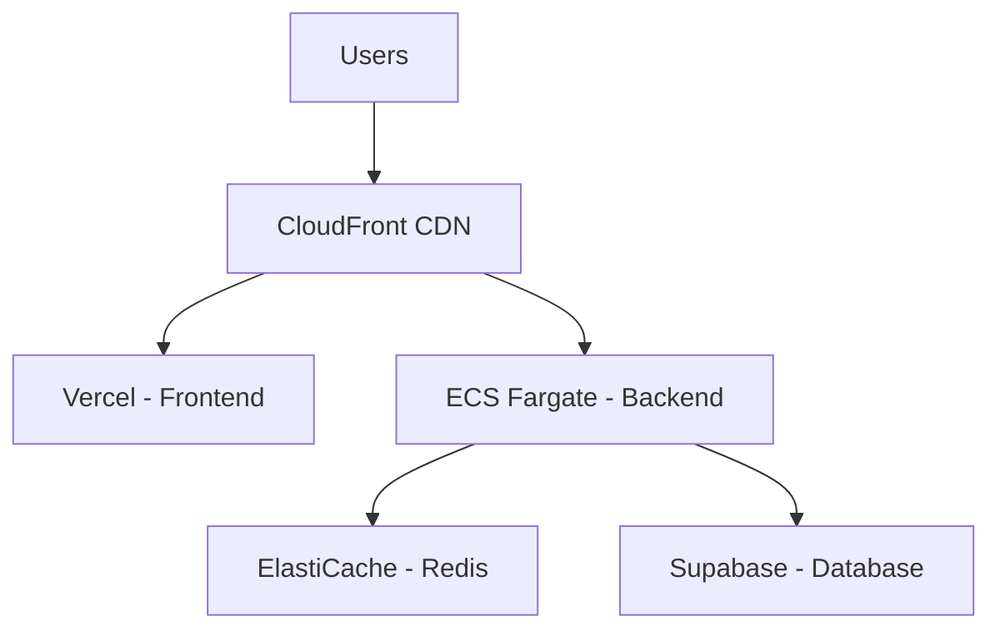

# Helium AI - Separate Component Deployment Guide
**Deploying Frontend, Backend, and Redis Independently on GCP/AWS**

## 🎯 Current Architecture Overview

Your Helium AI application consists of three main components:
1. **Frontend**: Next.js application (serves UI)
2. **Backend**: FastAPI application (APIs, business logic)
3. **Redis**: Caching and pub/sub messaging

Currently, these run together via Docker Compose. For production, we'll separate them for better scalability and reliability.

## ☁️ Deployment Options

### **Option 1: GCP (Recommended)**



### **Option 2: AWS**



## 🚀 Step-by-Step Deployment Process

### **Phase 1: Deploy Redis Separately**

#### **GCP Memorystore (Recommended)**
```bash
# 1. Create Redis instance
gcloud redis instances create helium-redis \
    --size=5 \
    --region=us-central1 \
    --tier=standard \
    --redis-version=redis_7_0

# 2. Get connection details
gcloud redis instances describe helium-redis --region=us-central1
```

#### **AWS ElastiCache**
```bash
# 1. Create Redis cluster via AWS Console or CLI
aws elasticache create-replication-group \
    --replication-group-id helium-redis \
    --replication-group-description "Helium Redis" \
    --engine redis \
    --cache-node-type cache.t3.micro \
    --num-cache-clusters 2 \
    --automatic-failover-enabled
```

### **Phase 2: Deploy Backend Separately**

#### **GCP Cloud Run**
```bash
# 1. Build Docker image
cd backend
docker build -t gcr.io/YOUR_PROJECT_ID/helium-backend:latest .

# 2. Push to Container Registry
docker push gcr.io/YOUR_PROJECT_ID/helium-backend:latest

# 3. Deploy to Cloud Run
gcloud run deploy helium-backend \
    --image gcr.io/YOUR_PROJECT_ID/helium-backend:latest \
    --platform managed \
    --region us-central1 \
    --allow-unauthenticated \
    --set-env-vars REDIS_HOST=YOUR_REDIS_IP,REDIS_PORT=6379 \
    --memory 2Gi \
    --cpu 2
```

#### **AWS ECS Fargate**
```bash
# 1. Create task definition (save as task-definition.json)
{
  "family": "helium-backend",
  "networkMode": "awsvpc",
  "requiresCompatibilities": ["FARGATE"],
  "cpu": "1024",
  "memory": "2048",
  "executionRoleArn": "arn:aws:iam::ACCOUNT:role/ecsTaskExecutionRole",
  "containerDefinitions": [
    {
      "name": "helium-backend",
      "image": "ACCOUNT.dkr.ecr.REGION.amazonaws.com/helium-backend:latest",
      "portMappings": [
        {
          "containerPort": 8000,
          "protocol": "tcp"
        }
      ],
      "environment": [
        {
          "name": "REDIS_HOST",
          "value": "YOUR_ELASTICACHE_ENDPOINT"
        },
        {
          "name": "REDIS_PORT",
          "value": "6379"
        }
      ]
    }
  ]
}

# 2. Register task definition
aws ecs register-task-definition --cli-input-json file://task-definition.json

# 3. Create service
aws ecs create-service \
    --cluster helium-cluster \
    --service-name helium-backend \
    --task-definition helium-backend \
    --desired-count 2 \
    --launch-type FARGATE
```

### **Phase 3: Deploy Frontend Separately**

#### **Vercel Deployment (Recommended for Next.js)**
```bash
# 1. Install Vercel CLI
npm install -g vercel

# 2. Deploy frontend
cd frontend
vercel --prod

# 3. Set environment variables in Vercel dashboard:
# NEXT_PUBLIC_BACKEND_URL=https://your-cloud-run-url.a.run.app
# NEXT_PUBLIC_SUPABASE_URL=your-supabase-url
```

## 🔌 Connection Configuration

### **Backend Environment Variables**
Create a `.env.production` file in your backend:

```env
# Redis Configuration
REDIS_HOST=your-redis-host  # From Memorystore/ElastiCache
REDIS_PORT=6379
REDIS_PASSWORD=
REDIS_SSL=False

# Supabase Configuration
SUPABASE_URL=your-supabase-url
SUPABASE_SERVICE_ROLE_KEY=your-service-role-key

# Other configurations
LOG_LEVEL=INFO
ENV_MODE=PRODUCTION
```

### **Frontend Environment Variables**
Create a `.env.production` file in your frontend:

```env
# Backend API
NEXT_PUBLIC_BACKEND_URL=https://your-backend-url

# Supabase
NEXT_PUBLIC_SUPABASE_URL=your-supabase-url
NEXT_PUBLIC_SUPABASE_ANON_KEY=your-anon-key

# Environment
NEXT_PUBLIC_ENV_MODE=production
```

## 🔄 Update Your Code for Separate Deployment

### **1. Update Redis Connection in Backend**

File: `backend/services/redis.py`
```python
# Add support for production Redis configuration
def initialize():
    """Initialize Redis connection pool using environment variables."""
    global client, pool

    # Load environment variables
    load_dotenv()

    # Get Redis configuration
    redis_host = os.getenv("REDIS_HOST", "localhost")  # Default to localhost for dev
    redis_port = int(os.getenv("REDIS_PORT", 6379))
    redis_password = os.getenv("REDIS_PASSWORD", "")
    redis_ssl = os.getenv("REDIS_SSL", "False").lower() == "true"
    
    # Connection pool configuration
    max_connections = int(os.getenv("REDIS_MAX_CONNECTIONS", 128))
    socket_timeout = float(os.getenv("REDIS_SOCKET_TIMEOUT", 15.0))
    connect_timeout = float(os.getenv("REDIS_CONNECT_TIMEOUT", 10.0))

    logger.debug(f"Initializing Redis connection to {redis_host}:{redis_port}")

    # Create connection pool
    pool = redis.ConnectionPool(
        host=redis_host,
        port=redis_port,
        password=redis_password,
        decode_responses=True,
        socket_timeout=socket_timeout,
        socket_connect_timeout=connect_timeout,
        socket_keepalive=True,
        health_check_interval=30,
        max_connections=max_connections,
        ssl=redis_ssl
    )

    # Create Redis client
    client = redis.Redis(connection_pool=pool)
    return client
```

### **2. Update Supabase Connection**

File: `backend/services/supabase.py`
```python
# Ensure proper environment variable handling
class DBConnection:
    async def initialize(self):
        """Initialize the database connection."""
        if self._initialized:
            return
                
        try:
            # Use service role key for backend operations
            supabase_url = os.getenv("SUPABASE_URL")
            supabase_key = os.getenv("SUPABASE_SERVICE_ROLE_KEY") or os.getenv("SUPABASE_ANON_KEY")
            
            if not supabase_url or not supabase_key:
                logger.error("Missing required Supabase environment variables")
                raise RuntimeError("SUPABASE_URL and key environment variables must be set.")

            logger.debug("Initializing Supabase connection")
            
            # Create Supabase client
            self._client = await create_async_client(
                supabase_url, 
                supabase_key,
            )
            
            self._initialized = True
            logger.debug("Database connection initialized successfully")
            
        except Exception as e:
            logger.error(f"Database initialization error: {e}")
            raise RuntimeError(f"Failed to initialize database connection: {str(e)}")
```

### **3. Update Frontend API Configuration**

File: `frontend/src/lib/api.ts` (or similar)
```typescript
// Use environment variables for API configuration
const getBackendUrl = () => {
  if (typeof window === 'undefined') {
    // Server-side - use internal service URL in production
    return process.env.BACKEND_INTERNAL_URL || process.env.NEXT_PUBLIC_BACKEND_URL || 'http://localhost:8000';
  }
  // Client-side - use public URL
  return process.env.NEXT_PUBLIC_BACKEND_URL || 'http://localhost:8000';
};

export const API_BASE_URL = getBackendUrl();
export const SUPABASE_URL = process.env.NEXT_PUBLIC_SUPABASE_URL || '';
export const SUPABASE_ANON_KEY = process.env.NEXT_PUBLIC_SUPABASE_ANON_KEY || '';
```

## 🛠️ Production Dockerfile Updates

### **Backend Dockerfile**
```dockerfile
# backend/Dockerfile.prod
FROM python:3.11-slim

# Install system dependencies
RUN apt-get update && apt-get install -y \
    curl \
    && rm -rf /var/lib/apt/lists/*

# Create non-root user
RUN groupadd -r appuser && useradd -r -g appuser appuser

# Set working directory
WORKDIR /app

# Install UV package manager
COPY --from=ghcr.io/astral-sh/uv:latest /uv /usr/local/bin/uv

# Copy dependency files
COPY pyproject.toml uv.lock ./

# Install dependencies
RUN uv sync --frozen --no-dev

# Copy source code
COPY --chown=appuser:appuser . .

# Switch to non-root user
USER appuser

# Health check
HEALTHCHECK --interval=30s --timeout=10s --start-period=5s --retries=3 \
    CMD curl -f http://localhost:8000/api/health || exit 1

# Expose port
EXPOSE 8000

# Run application
CMD ["uv", "run", "uvicorn", "api:app", "--host", "0.0.0.0", "--port", "8000"]
```

## 🔒 Security Considerations

### **Environment Variable Management**

1. **GCP Secret Manager**
```bash
# Store secrets in GCP Secret Manager
echo -n "your-secret-value" | gcloud secrets create supabase-key --data-file=-

# Access in Cloud Run
gcloud run deploy helium-backend \
    --image gcr.io/YOUR_PROJECT_ID/helium-backend:latest \
    --set-secrets SUPABASE_SERVICE_ROLE_KEY=supabase-key:latest
```

2. **AWS Secrets Manager**
```bash
# Store secrets in AWS Secrets Manager
aws secretsmanager create-secret \
    --name helium/supabase-key \
    --description "Supabase service role key" \
    --secret-string "your-secret-value"

# Access in ECS task definition
{
  "name": "SUPABASE_SERVICE_ROLE_KEY",
  "valueFrom": "arn:aws:ssm:REGION:ACCOUNT:parameter/helium/supabase-key"
}
```

## 📈 Performance Optimization

### **Backend Caching Strategy**

File: `backend/cache/optimized_cache.py`
```python
import redis.asyncio as redis
import json
import asyncio
from typing import Optional, Any

class OptimizedCache:
    def __init__(self):
        self.redis_client = None
        self.local_cache = {}
        self.local_cache_ttl = {}
        self.max_local_cache_size = 1000
        
    async def initialize(self):
        """Initialize Redis connection"""
        redis_url = os.getenv("REDIS_URL", "redis://localhost:6379")
        self.redis_client = redis.Redis.from_url(
            redis_url,
            decode_responses=True,
            health_check_interval=30
        )
        
    async def get(self, key: str) -> Optional[Any]:
        """Get value with local cache first, then Redis"""
        # Check local cache first
        if key in self.local_cache:
            if asyncio.get_event_loop().time() < self.local_cache_ttl[key]:
                return self.local_cache[key]
            else:
                # Expired, remove from local cache
                del self.local_cache[key]
                del self.local_cache_ttl[key]
        
        # Check Redis
        if self.redis_client:
            try:
                value = await self.redis_client.get(key)
                if value:
                    parsed_value = json.loads(value)
                    # Store in local cache
                    if len(self.local_cache) < self.max_local_cache_size:
                        self.local_cache[key] = parsed_value
                        self.local_cache_ttl[key] = asyncio.get_event_loop().time() + 300  # 5 minutes
                    return parsed_value
            except Exception as e:
                logger.warning(f"Redis cache get failed: {e}")
                
        return None
        
    async def set(self, key: str, value: Any, ttl: int = 3600):
        """Set value in both local cache and Redis"""
        # Store in local cache
        if len(self.local_cache) < self.max_local_cache_size:
            self.local_cache[key] = value
            self.local_cache_ttl[key] = asyncio.get_event_loop().time() + min(ttl, 300)
            
        # Store in Redis
        if self.redis_client:
            try:
                await self.redis_client.setex(
                    key, 
                    ttl, 
                    json.dumps(value, default=str)
                )
            except Exception as e:
                logger.error(f"Redis cache set failed: {e}")
```

## 🚦 CI/CD Pipeline for Separate Deployments

### **GitHub Actions Workflow**

File: `.github/workflows/separate-deploy.yml`
```yaml
name: Deploy Separate Components

on:
  push:
    branches: [main]

jobs:
  deploy-redis:
    runs-on: ubuntu-latest
    steps:
      - name: Setup gcloud
        uses: google-github-actions/setup-gcloud@v1
        with:
          service_account_key: ${{ secrets.GCP_SA_KEY }}
          project_id: ${{ secrets.GCP_PROJECT_ID }}
          
      - name: Deploy Redis if needed
        run: |
          # Check if Redis instance exists
          if ! gcloud redis instances describe helium-redis --region=us-central1; then
            gcloud redis instances create helium-redis \
              --size=5 \
              --region=us-central1 \
              --tier=standard \
              --redis-version=redis_7_0
          fi

  deploy-backend:
    needs: deploy-redis
    runs-on: ubuntu-latest
    steps:
      - uses: actions/checkout@v4
      
      - name: Setup gcloud
        uses: google-github-actions/setup-gcloud@v1
        with:
          service_account_key: ${{ secrets.GCP_SA_KEY }}
          project_id: ${{ secrets.GCP_PROJECT_ID }}
          
      - name: Configure Docker
        run: gcloud auth configure-docker
        
      - name: Build and push backend
        run: |
          cd backend
          docker build -t gcr.io/${{ secrets.GCP_PROJECT_ID }}/helium-backend:${{ github.sha }} -f Dockerfile.prod .
          docker push gcr.io/${{ secrets.GCP_PROJECT_ID }}/helium-backend:${{ github.sha }}
          
      - name: Deploy to Cloud Run
        run: |
          gcloud run deploy helium-backend \
            --image gcr.io/${{ secrets.GCP_PROJECT_ID }}/helium-backend:${{ github.sha }} \
            --region us-central1 \
            --platform managed \
            --allow-unauthenticated \
            --set-env-vars REDIS_HOST=${{ secrets.REDIS_HOST }},REDIS_PORT=6379 \
            --memory 2Gi \
            --cpu 2

  deploy-frontend:
    needs: deploy-backend
    runs-on: ubuntu-latest
    steps:
      - uses: actions/checkout@v4
      
      - name: Deploy to Vercel
        uses: amondnet/vercel-action@v25
        with:
          vercel-token: ${{ secrets.VERCEL_TOKEN }}
          vercel-org-id: ${{ secrets.VERCEL_ORG_ID }}
          vercel-project-id: ${{ secrets.VERCEL_PROJECT_ID }}
          working-directory: ./frontend
          vercel-args: '--prod'
```

## 🧪 Testing Connection Between Components

### **Health Check Endpoints**

1. **Backend Health Check**
```python
# Add to backend/api.py
@app.get("/health")
async def health_check():
    """Comprehensive health check"""
    health_status = {
        "status": "ok",
        "timestamp": datetime.now(timezone.utc).isoformat(),
        "components": {}
    }
    
    # Check Redis
    try:
        redis_client = await get_redis_client()
        await redis_client.ping()
        health_status["components"]["redis"] = "ok"
    except Exception as e:
        health_status["components"]["redis"] = f"error: {str(e)}"
        health_status["status"] = "degraded"
        
    # Check Supabase
    try:
        db = DBConnection()
        await db.initialize()
        db_client = await db.client
        await db_client.table("threads").select("thread_id").limit(1).execute()
        health_status["components"]["database"] = "ok"
    except Exception as e:
        health_status["components"]["database"] = f"error: {str(e)}"
        health_status["status"] = "degraded"
        
    return health_status
```

2. **Test Script**
```bash
#!/bin/bash
# test-connections.sh

echo "Testing backend health endpoint..."
curl -f https://your-backend-url/api/health || echo "Backend health check failed"

echo "Testing Redis connection..."
redis-cli -h YOUR_REDIS_HOST -p 6379 ping || echo "Redis connection failed"

echo "Testing frontend build..."
cd frontend && npm run build || echo "Frontend build failed"
```

## 💰 Cost Estimation (Monthly)

### **GCP Pricing**
- **Cloud Run**: $50-200 (based on requests)
- **Memorystore**: $150 (5GB HA)
- **Vercel**: $20-120 (based on usage)
- **Cloudflare**: Free tier available
- **Total**: ~$220-490/month

### **AWS Pricing**
- **ECS Fargate**: $100-300 (based on usage)
- **ElastiCache**: $50-150 (based on size)
- **Vercel**: $20-120
- **CloudFront**: $20-100
- **Total**: ~$190-670/month

## 🚀 Deployment Checklist

### **Pre-deployment**
- [ ] Set up cloud account (GCP/AWS)
- [ ] Configure billing alerts
- [ ] Create project/infrastructure
- [ ] Set up DNS/domain
- [ ] Configure CI/CD secrets

### **Deployment**
- [ ] Deploy Redis (Memorystore/ElastiCache)
- [ ] Deploy Backend (Cloud Run/ECS)
- [ ] Deploy Frontend (Vercel)
- [ ] Configure environment variables
- [ ] Set up monitoring/alerts

### **Post-deployment**
- [ ] Test all endpoints
- [ ] Verify component connections
- [ ] Run load tests
- [ ] Monitor performance
- [ ] Set up backups

## 🆘 Troubleshooting Common Issues

### **Connection Issues**
1. **Redis Connection Failed**
   - Check Redis endpoint and port
   - Verify security groups/firewall rules
   - Ensure Redis instance is running

2. **Backend Cannot Reach Supabase**
   - Verify Supabase URL and keys
   - Check network connectivity
   - Confirm Supabase project settings

3. **Frontend Cannot Reach Backend**
   - Check CORS configuration
   - Verify backend URL in frontend env vars
   - Confirm backend is accessible publicly

### **Performance Issues**
1. **Slow Redis Operations**
   - Increase Redis instance size
   - Optimize Redis commands
   - Add local caching layer

2. **High Backend Latency**
   - Check database query performance
   - Optimize API endpoints
   - Add more backend instances

3. **Frontend Loading Slow**
   - Optimize bundle size
   - Enable CDN caching
   - Implement code splitting

This guide provides a comprehensive approach to deploying your Helium AI components separately while maintaining connectivity. The key is proper environment variable configuration and ensuring network access between components.