# Helium AI Worker - AWS + Cloudflare + Daytona.io Deployment Architecture

## System Architecture Overview

```mermaid
graph TB
    %% External Users and Services
    Users[👥 Users] --> CF[🌐 Cloudflare<br/>CDN, DNS, WAF, SSL]
    
    %% DNS and Domain Management
    CF --> ALB[⚖️ Application Load Balancer<br/>SSL Termination & Routing]
    
    %% ECS Fargate Services Cluster (Simplified)
    subgraph ECSCluster["🏗️ ECS Fargate Cluster"]
        FrontendECS[📱 Next.js Frontend<br/>SSR & Static Assets]
        BackendECS[⚙️ FastAPI Backend<br/>API Services]
        WorkerECS[🔄 Dramatiq Workers<br/>Background Jobs]
    end
    
    %% Daytona.io Integration
    subgraph DaytonaCluster["🐳 Daytona.io Sandbox"]
        Daytona[Agent Sandbox<br/>Development Environments]
    end
    
    %% Container Registry
    ECR[📦 ECR<br/>Container Registry] --> FrontendECS
    ECR --> BackendECS
    ECR --> WorkerECS
    
    %% Load Balancer Connections
    ALB --> FrontendECS
    ALB --> BackendECS
    ALB --> WorkerECS
    
    %% Daytona.io Integration
    BackendECS --> Daytona
    WorkerECS --> Daytona
    
    %% Caching and Storage
    Redis[💾 ElastiCache Redis<br/>Cluster Mode] --> BackendECS
    Redis --> WorkerECS
    
    %% External Services Integration
    subgraph ExternalServices["🌐 External Services"]
        Supabase[🗄️ Supabase<br/>Database & Auth]
        AIAPIs[🤖 AI APIs<br/>OpenAI, Anthropic, Vertex AI]
        Stripe[💳 Stripe<br/>Billing & Payments]
        Monitoring[📊 Monitoring<br/>Sentry, Langfuse]
    end
    
    %% Backend Service Connections
    BackendECS --> Supabase
    BackendECS --> AIAPIs
    BackendECS --> Stripe
    BackendECS --> Monitoring
    
    %% Network Infrastructure
    subgraph NetworkInfra["🔒 Network Infrastructure"]
        VPC[🏠 VPC<br/>Network Isolation]
        SecurityGroups[🛡️ Security Groups<br/>Firewall Rules]
        Subnets[🌐 Subnets<br/>Public/Private]
    end
    
    %% Network Connections
    VPC --> FrontendECS
    VPC --> BackendECS
    VPC --> WorkerECS
    VPC --> Redis
    
    %% Monitoring and Logging
    CloudWatch[📈 CloudWatch<br/>Logs & Metrics] --> FrontendECS
    CloudWatch --> BackendECS
    CloudWatch --> WorkerECS
    
    %% Security and Access Control
    IAM[🔐 IAM<br/>Access Control] --> FrontendECS
    IAM --> BackendECS
    IAM --> WorkerECS
    IAM --> Redis
    IAM --> ECR
    
    %% Styling
    classDef aws fill:#ff9900,stroke:#232f3e,stroke-width:3px,color:#fff
    classDef external fill:#6c757d,stroke:#495057,stroke-width:2px,color:#fff
    classDef compute fill:#0073bb,stroke:#005a8b,stroke-width:2px,color:#fff
    classDef network fill:#28a745,stroke:#1e7e34,stroke-width:2px,color:#fff
    classDef storage fill:#17a2b8,stroke:#138496,stroke-width:2px,color:#fff
    classDef cloudflare fill:#f38020,stroke:#000,stroke-width:3px,color:#fff
    classDef daytona fill:#00d4aa,stroke:#000,stroke-width:3px,color:#fff
    
    class ALB,ECR,Redis,VPC,CloudWatch,IAM aws
    class Supabase,AIAPIs,Stripe,Monitoring external
    class FrontendECS,BackendECS,WorkerECS compute
    class SecurityGroups,Subnets network
    class Redis storage
    class CF cloudflare
    class Daytona daytona
```

## Data Flow Architecture

## Infrastructure Components Detail

### 🏗️ **ECS Fargate Services**

| Service | CPU | Memory | Scaling | Purpose |
|---------|-----|--------|---------|---------|
| Frontend | 0.5 vCPU | 1GB | Auto-scale | Next.js SSR app |
| Backend | 1 vCPU | 2GB | Auto-scale | FastAPI services |
| Workers | 1 vCPU | 2GB | Queue-based | Background jobs |

### 🐳 **Daytona.io Sandbox**

| Feature | Description | Benefits |
|---------|-------------|----------|
| Environment | Cloud-based development environments | No server management |
| Scaling | On-demand resource allocation | Cost-effective |
| Security | Built-in isolation and security | Enhanced security |
| Integration | Daytona SDK integration | Easy management |

### 🌐 **Network Architecture**

```mermaid
graph TB
    subgraph VPC["🏠 VPC (10.0.0.0/16)"]
        subgraph PublicSubnets["🌐 Public Subnets"]
            ALBSubnet1[ALB Subnet 1<br/>10.0.1.0/24]
            ALBSubnet2[ALB Subnet 2<br/>10.0.2.0/24]
        end
        
        subgraph PrivateSubnets["🔒 Private Subnets"]
            ECSSubnet1[ECS Subnet 1<br/>10.0.10.0/24]
            ECSSubnet2[ECS Subnet 2<br/>10.0.11.0/24]
            RedisSubnet1[Redis Subnet 1<br/>10.0.20.0/24]
            RedisSubnet2[Redis Subnet 2<br/>10.0.21.0/24]
        end
        
        IGW[Internet Gateway]
        NAT[NAT Gateway]
    end
    
    IGW --> ALBSubnet1
    IGW --> ALBSubnet2
    NAT --> ECSSubnet1
    NAT --> ECSSubnet2
    NAT --> RedisSubnet1
    NAT --> RedisSubnet2
```

### 💾 **ElastiCache Redis Configuration**

```mermaid
graph LR
    subgraph RedisCluster["💾 Redis Cluster"]
        Primary[Primary Node<br/>us-east-1a]
        Replica1[Replica Node<br/>us-east-1b]
        Replica2[Replica Node<br/>us-east-1c]
    end
    
    Primary --> Replica1
    Primary --> Replica2
    
    BackendECS --> Primary
    WorkerECS --> Primary
    BackendECS --> Replica1
    WorkerECS --> Replica2
```

## Deployment Phases

### Phase 1: Foundation 🏗️
1. **VPC Setup**: Create network infrastructure
2. **Security Groups**: Configure firewall rules
3. **ECR Repositories**: Set up container registry
4. **ElastiCache**: Deploy Redis cluster

### Phase 2: Core Services ⚙️
1. **Backend Deployment**: FastAPI on ECS Fargate
2. **Frontend Deployment**: Next.js on ECS Fargate
3. **Worker Deployment**: Dramatiq workers on ECS Fargate
4. **Sandbox Deployment**: Agent execution environment

### Phase 3: Load Balancing & CDN ⚖️
1. **ALB Configuration**: Load balancer setup
2. **CloudFront**: CDN distribution
3. **SSL Certificates**: HTTPS configuration
4. **Health Checks**: Service monitoring

### Phase 4: DNS & Monitoring 🌍
1. **Route53**: DNS configuration for he2.ai
2. **CloudWatch**: Monitoring and alerting
3. **External Monitoring**: Sentry, Langfuse integration
4. **Performance Optimization**: Fine-tuning

## Security Architecture

```mermaid
graph TB
    subgraph SecurityLayers["🛡️ Security Layers"]
        WAF[WAF<br/>Web Application Firewall]
        ALB[ALB<br/>SSL Termination]
        SecurityGroups[Security Groups<br/>Network Firewall]
        IAM[IAM<br/>Access Control]
        Encryption[Encryption<br/>At Rest & In Transit]
    end
    
    Internet --> WAF
    WAF --> ALB
    ALB --> SecurityGroups
    SecurityGroups --> ECSCluster
    IAM --> ECSCluster
    Encryption --> ECSCluster
```

## Cost Breakdown (Monthly Estimates)

| Service | Cost Range | Notes |
|---------|------------|-------|
| ECS Fargate | $100-200 | Reduced - no sandbox service |
| ElastiCache Redis | $50-100 | Cluster mode, 3 nodes |
| Application Load Balancer | $20-30 | Fixed cost + data processing |
| ECR | $5-15 | Container image storage |
| Cloudflare | $0-20 | Free tier available |
| Daytona.io | $50-150 | On-demand sandbox environments |
| **Total** | **$225-515** | **Production-ready setup** |

## Monitoring & Observability

This architecture provides a robust, scalable, and secure deployment strategy for your Helium AI Worker on AWS with Cloudflare and Daytona.io integration while maintaining Supabase as your database and using the he2.ai domain.
