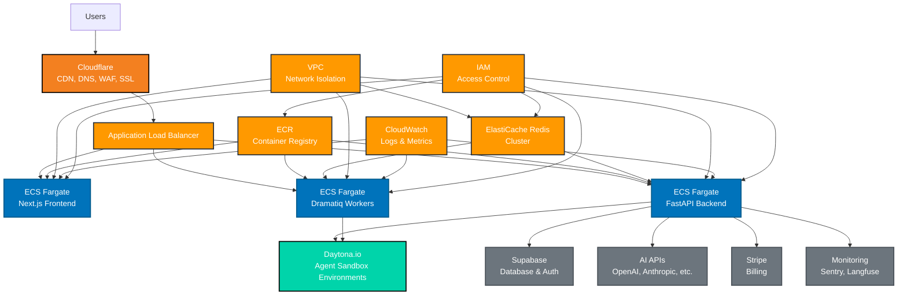

# AWS + Cloudflare + Daytona.io Deployment Architecture for Helium AI Worker

## Updated System Architecture Diagram



## Infrastructure Components

### 1. **Frontend Service (Next.js)**
- **Deployment**: ECS Fargate with auto-scaling
- **Resources**: 0.5 vCPU, 1GB RAM (can scale up)
- **Features**: SSR, static asset optimization
- **CDN**: Cloudflare for global distribution

### 2. **Backend Service (FastAPI)**
- **Deployment**: ECS Fargate with auto-scaling
- **Resources**: 1 vCPU, 2GB RAM (can scale up)
- **Features**: Multiple API modules, health checks
- **Load Balancing**: ALB with health checks

### 3. **Background Workers (Dramatiq)**
- **Deployment**: ECS Fargate with auto-scaling
- **Resources**: 1 vCPU, 2GB RAM
- **Features**: Async job processing, Redis integration
- **Scaling**: Based on queue depth

### 4. **Agent Sandbox (Daytona.io)**
- **Deployment**: Cloud-based development environments
- **Resources**: On-demand scaling
- **Features**: Isolated agent execution, pre-configured environments
- **Integration**: Daytona SDK for sandbox management
- **Security**: Built-in isolation and security

### 5. **ElastiCache Redis**
- **Type**: Redis cluster mode
- **Nodes**: 3 nodes (1 primary, 2 replicas)
- **Features**: High availability, automatic failover
- **Use Cases**: Session storage, job queues, caching

### 6. **Application Load Balancer**
- **Type**: Application Load Balancer
- **Features**: SSL termination, health checks, path-based routing
- **Security**: WAF integration, DDoS protection

### 7. **Cloudflare CDN & Services**
- **Features**: Global edge network, API acceleration
- **Services**: CDN, DNS management, WAF, SSL/TLS
- **Domain**: he2.ai DNS management
- **Security**: DDoS protection, geographic restrictions

## Terraform Module Recommendations

Based on my research using Terraform MCP servers, here are the recommended modules:

### Core Infrastructure
- **VPC**: `terraform-aws-modules/vpc/aws/6.0.1` (144M+ downloads)
- **ECS Fargate**: `cn-terraform/ecs-fargate-service/aws/2.0.48` (190K+ downloads)
- **ALB**: `umotif-public/alb/aws/2.2.2` (162K+ downloads)
- **ElastiCache**: `cloudposse/elasticache-redis/aws/1.10.0` (9M+ downloads)
- **ECR**: `terraform-aws-modules/ecr/aws/3.0.1` (9M+ downloads)

### External Services (No Terraform needed)
- **Cloudflare**: Managed via Cloudflare dashboard or API
- **Daytona.io**: Managed via Daytona.io platform
- **Supabase**: External service (as requested)

## Deployment Strategy

### Phase 1: Core Infrastructure
1. **VPC Setup**: Create VPC with public/private subnets across multiple AZs
2. **Security Groups**: Configure network security rules
3. **ECR Setup**: Create container repositories
4. **ElastiCache**: Deploy Redis cluster

### Phase 2: Application Services
1. **Backend Deployment**: Deploy FastAPI backend to ECS Fargate
2. **Frontend Deployment**: Deploy Next.js frontend to ECS Fargate
3. **Worker Deployment**: Deploy Dramatiq workers to ECS Fargate

### Phase 3: Load Balancing and External Services
1. **ALB Setup**: Configure Application Load Balancer
2. **Cloudflare Setup**: Configure DNS, CDN, and WAF
3. **Daytona.io Integration**: Configure sandbox environments
4. **SSL Certificates**: Configure HTTPS with Cloudflare

### Phase 4: Monitoring and Optimization
1. **CloudWatch**: Set up monitoring and alerting
2. **Health Checks**: Configure comprehensive health monitoring
3. **Performance Optimization**: Fine-tune caching and scaling

## Environment Configuration

### Production Environment Variables
```bash
# Environment
ENV_MODE=production

# Supabase (External)
SUPABASE_URL=your-supabase-url
SUPABASE_ANON_KEY=your-supabase-anon-key
SUPABASE_SERVICE_ROLE_KEY=your-service-role-key

# Redis (ElastiCache)
REDIS_HOST=your-elasticache-endpoint
REDIS_PORT=6379
REDIS_SSL=true

# Daytona.io Configuration
DAYTONA_API_KEY=your-daytona-api-key
DAYTONA_SERVER_URL=https://app.daytona.io/api
DAYTONA_TARGET=us

# AWS Services
AWS_REGION=us-east-1
AWS_ACCESS_KEY_ID=your-access-key
AWS_SECRET_ACCESS_KEY=your-secret-key

# External APIs
OPENAI_API_KEY=your-openai-key
ANTHROPIC_API_KEY=your-anthropic-key
# ... other API keys
```

## Cost Optimization

### Estimated Monthly Costs (US East)
- **ECS Fargate**: ~$100-200 (reduced - no sandbox service)
- **ElastiCache Redis**: ~$50-100
- **ALB**: ~$20-30
- **ECR**: ~$5-15
- **Cloudflare**: ~$0-20 (free tier available)
- **Daytona.io**: ~$50-150 (depending on usage)
- **Total**: ~$225-515/month

### Cost Optimization Strategies
1. **Auto-scaling**: Scale services based on demand
2. **Spot Instances**: Use Spot instances for non-critical workloads
3. **Reserved Capacity**: Consider Reserved Instances for predictable workloads
4. **Cloudflare**: Leverage free tier and optimize caching
5. **Daytona.io**: Use on-demand scaling for sandbox environments

## Security Considerations

### Network Security
- **VPC**: Private subnets for backend services
- **Security Groups**: Restrictive firewall rules
- **NACLs**: Additional network-level security

### Application Security
- **IAM Roles**: Least privilege access
- **Secrets Management**: AWS Secrets Manager for API keys
- **Cloudflare WAF**: Web Application Firewall for DDoS protection
- **SSL/TLS**: End-to-end encryption via Cloudflare

### Data Security
- **Encryption**: Data encryption at rest and in transit
- **Backup**: Automated backups for Redis
- **Monitoring**: Comprehensive logging and monitoring
- **Daytona.io**: Built-in sandbox isolation and security

## Monitoring and Observability

### CloudWatch Integration
- **Logs**: Centralized logging for all services
- **Metrics**: Custom metrics for application performance
- **Alarms**: Automated alerting for critical issues

### External Monitoring
- **Sentry**: Error tracking and performance monitoring
- **Langfuse**: LLM call tracing and analytics
- **Cloudflare Analytics**: CDN and security metrics
- **Daytona.io Monitoring**: Sandbox usage and performance
- **Custom Dashboards**: Business metrics and KPIs

## Next Steps

1. **Create Terraform Configuration**: Set up infrastructure as code
2. **CI/CD Pipeline**: Automated deployment pipeline
3. **Environment Setup**: Staging and production environments
4. **Cloudflare Configuration**: DNS, CDN, and WAF setup
5. **Daytona.io Integration**: Sandbox environment configuration
6. **Monitoring Setup**: Comprehensive observability
7. **Security Review**: Security audit and compliance
8. **Performance Testing**: Load testing and optimization
9. **Go Live**: Production deployment and monitoring

This architecture provides a scalable, secure, and cost-effective deployment strategy for your Helium AI Worker on AWS with Cloudflare and Daytona.io integration while maintaining Supabase as your database and using the he2.ai domain.
